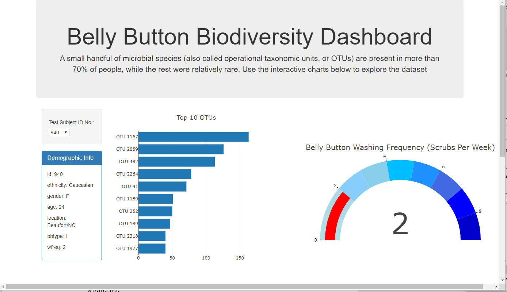
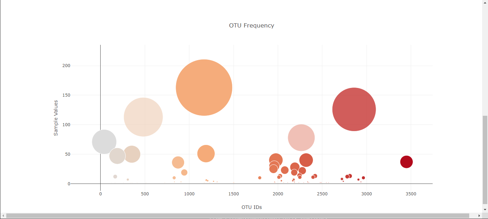

# Plotly Challenge:

## This repository contains the folders and files regarding a Plotly exercise that was performed with data related to Belly-Button Bio-Diversity, which catalogs the microbes that colonize human levels. 

### Files and Folder Structure:
This repository contains the following:
1. A folder called "data". This folder contains a json file called "samples.json" that contains the dataset used for this exercise.
2. A folder called "images". This folder contains the images of the top half and the bottom half of the dashboard that was built as part of this exercise.
3. A fodler called "static". In this folder, is another folder called "js" that contains the javascript file called "app" that is used in conjunction with the HTML file.
4. An HTML file called "index" which is the file used for the webpage dashboard.

### Dataset Details:
The dataset contained the following columns:
* Names (in the form of IDs)
* Metadata for each ID (the demographic information for the individual)
 * - Ethnicity
 * - Gender
 * - Age
 * - Location
 * - Belly Button Type
 * - Belly Button Wash Frequency (Scrubs Per Week)
* Samples for each ID
 * - OTU Operational Taxonomic Unit)IDs also known as microbial species
 * - OTU Labels
 * - Sample Values Observed

### Webpage Dashboard Details:
We were asked to build a webpage dashboard containing the following:
1.	A Dropdown box allowing the user to choose any ID from the list.
2.	A Panel under the dropdown list that would display the Metadata (the demographics) for the ID selected.
3.	A Bar Chart that displays the top 10 OTUs found for the ID selected.
4.	A Bubble Chart that displays each sample for the ID selected. The X axis displays the OTU IDs. The Y axis displays the sample values. The size of the bubbles is proportionate to the sample values.
5.	A Gauge Chart that displays the Belly Button Wash Frequency (Scrubs Per Week) for the ID selected. This will be a number between 0 and 9. 

The Metadata Panel (containing the demographics) and the 3 charts (the bar chart, the bubble chart and the gauge chart) will update automatically when the user selects an ID from the dropdown box. 

The Dashboard can be found at the following link:
 
https://pi108.github.io/Plotly-Challenge/

This is an image of the Top Half of the Dashboard:

This is an image of the Bottom Half of the Dashboard:

### Additional information regarding Belly Button Diversity:
The following website conatins additional information regarding Belly Button Diversity.
 
http://robdunnlab.com/projects/belly-button-biodiversity/

